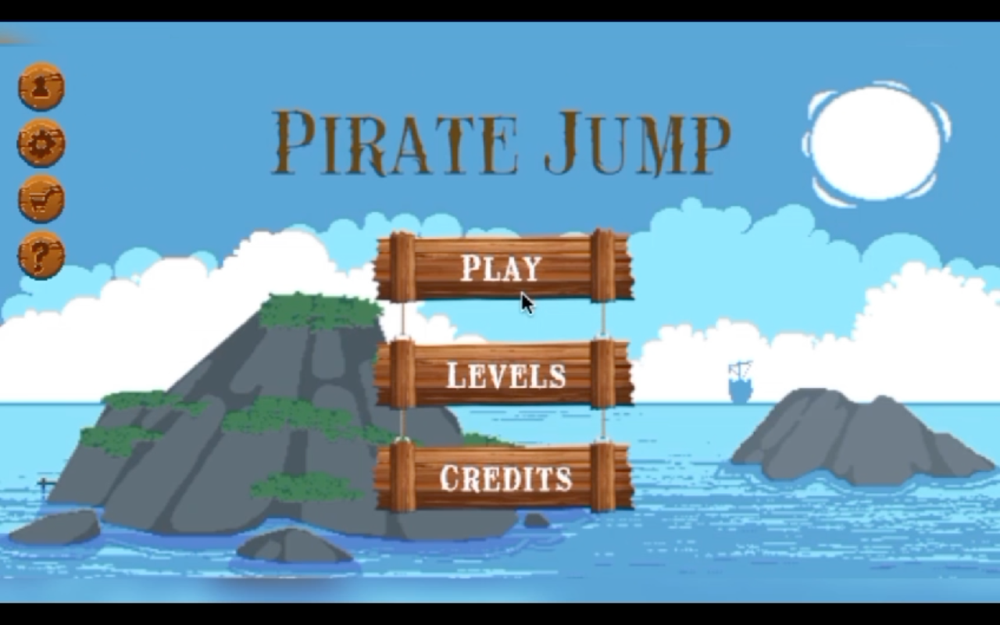
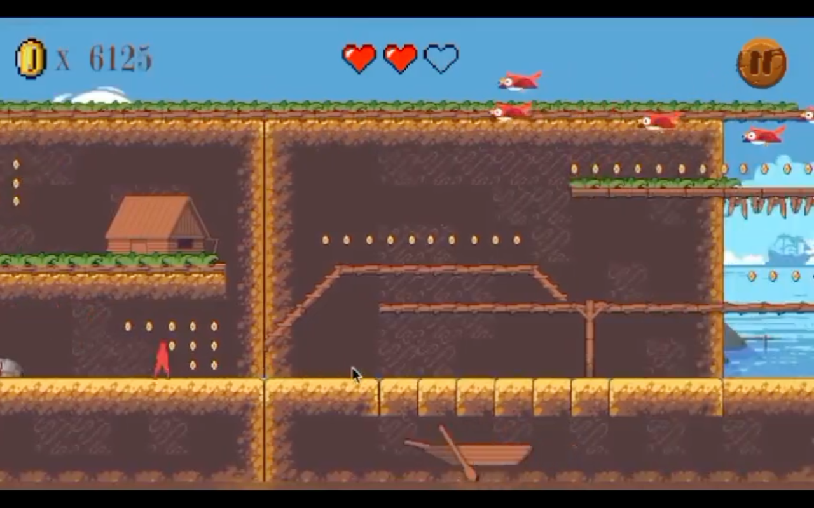
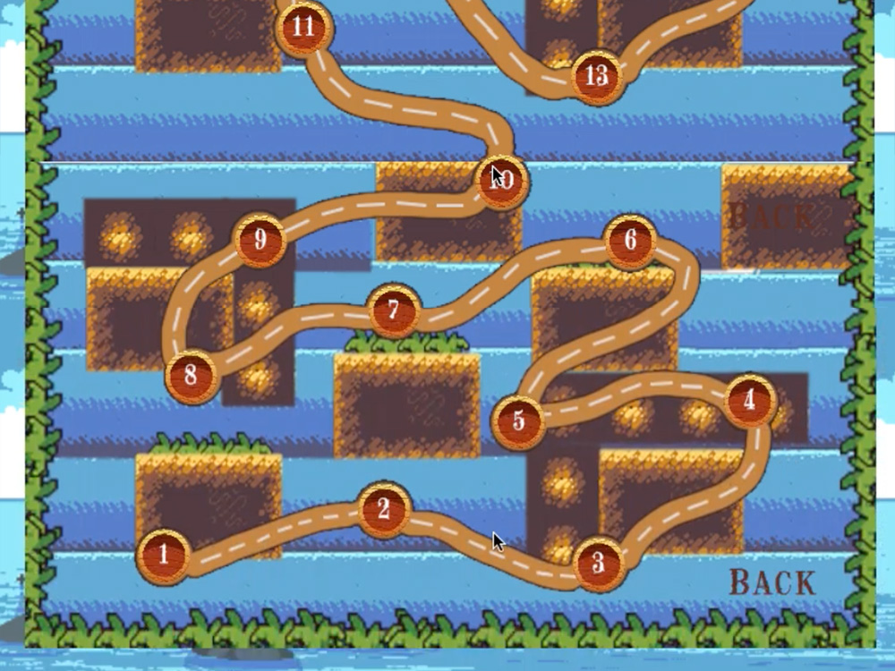
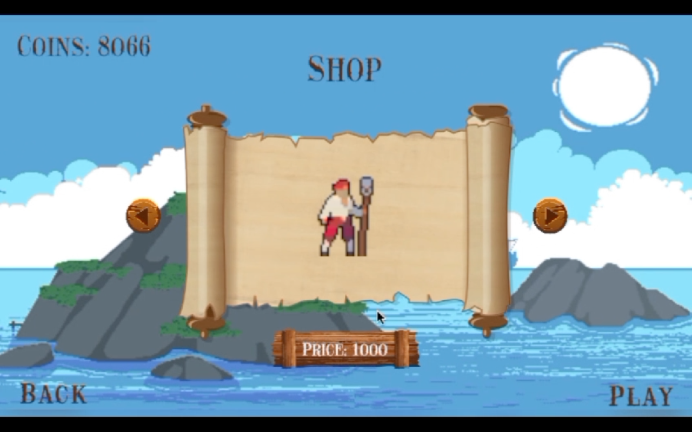

The project successfully achieved the client's goal of delivering a nostalgic gaming experience reminiscent of classic pirate adventures. 
With the provided graphics, we developed a straightforward 2D platformer game featuring simple yet engaging gameplay mechanics. 
Players were delighted by the charming pirate-themed world and the opportunity to explore different levels and options. The game's ease of play and captivating gameplay resonated with players of all ages, fulfilling the client's vision of evoking the charm of old classic pirate tales while providing an enjoyable gaming experience. 

Overall, the project was a success, meeting the client's expectations and delighting players with its nostalgic appeal and engaging gameplay.

